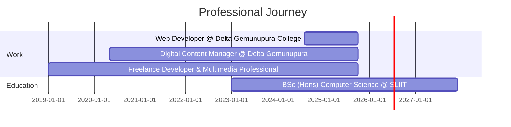

<div align="center">

<!-- Animated Header -->


<!-- Animated Typing -->
<a href="https://git.io/typing-svg"></a>

<p>
  <a href="https://mahimapaseda.vercel.app/"></a>
  <a href="https://www.linkedin.com/in/mahimapaseda"></a>
  <a href="https://www.youtube.com/@mahimapaseda"></a>
  <a href="https://www.instagram.com/mahi_pase_2002"></a>
</p>


</div>

## 🎯 About Me

```javascript
const mahima = {
    title: "Full-Stack Developer & Creative Technologist",
    location: "Colombo, Sri Lanka 🇱🇰",
    education: "BSc (Hons) Computer Science @ SLIIT City UNI",
    currentRole: "Web Developer @ Delta Gemunupura College",
    passions: ["Clean Code", "Innovation", "Problem Solving"],
    lifePhilosophy: "Code with purpose. Design with passion. Build with vision.",
    
    techStack: {
        frontend: ["HTML5", "CSS3", "JavaScript", "React", "Bootstrap", "SASS"],
        backend: ["Java", "Node.js", "Express.js", "PHP"],
        databases: ["MySQL", "MongoDB", "Firebase"],
        tools: ["Git", "VS Code", "Android Studio", "Google Cloud"],
        languages: ["Java", "JavaScript", "Kotlin", "C++", "SQL"]
    },
    
    currentlyLearning: ["Cloud Technologies", "Software Architecture", "Best Practices"],
    funFact: "I turn coffee into code and ideas into reality! ☕➡️💻"
};
```

<div align="center">

## 💼 Professional Snapshot

<table>
<tr>
<td align="center" width="200">
<br/>
<b>3+ Years</b><br/>
Development Experience
</td>
<td align="center" width="200">
<br/>
<b>10+ Projects</b><br/>
Successfully Delivered
</td>
<td align="center" width="200">
<br/>
<b>8+ Languages</b><br/>
Programming Mastery
</td>
<td align="center" width="200">
<br/>
<b>Multiple DBs</b><br/>
Database Expertise
</td>
</tr>
</table>

</div>

## 🛠️ Tech Arsenal

<details open>
<summary><b>🎨 Frontend Mastery</b></summary>
<br/>


</details>

<details open>
<summary><b>⚙️ Backend Power</b></summary>
<br/>


</details>

<details open>
<summary><b>🧰 Development Tools</b></summary>
<br/>


</details>

<details open>
<summary><b>💻 Programming Languages</b></summary>
<br/>


</details>

<div align="center">

## 🌟 Featured Projects

</div>

### 🏫 [Delta Gemunupura College Official Website](https://deltagemunupuracollege.lk/)

> A modern, responsive official website featuring school information, academic programs, news, gallery, and admin portal.

**🔧 Built with:** `HTML5` • `CSS3` • `JavaScript` • `Bootstrap` • `Responsive Design`

```
✨ Features: Multi-page Architecture | Admin Portal | Dynamic Content | Mobile-First Design
```

---

### 📱 [Delta Gemunupura College DBMS](https://github.com/mahimapaseda/Delta-Gemunupura-College-School-DBMS)

> Comprehensive Android DBMS with multi-layer security, staff management, student records, asset tracking, and exam management.

**🔧 Built with:** `Kotlin` • `Android` • `Firebase` • `Material Design` • `MVVM Architecture`

```
✨ Features: Multi-layer Security | Real-time Database | Staff & Student Management | Asset Tracking
```

---

### 🛒 [E-commerce Platform Backend](https://github.com/mahimapaseda/Y1S2-e-commerce-individual-)

> Year 1 Semester 2 project featuring product management, user authentication, and order processing system.

**🔧 Built with:** `PHP` • `JavaScript` • `MySQL` • `SQL`

```
✨ Features: Product Management | User Authentication | Order Processing | Database Integration
```

---

<div align="center">

## 📊 GitHub Analytics


<br/><br/>


<br/><br/>


<br/><br/>


</div>

## 💼 Experience Timeline



<div align="center">

## 🎯 Beyond Code

**Leadership** • **Videography** • **Photography** • **Video Editing**  
**Event Management** • **Project Management** • **Technology Consulting**


---

### 💭 Philosophy

> *"Code with purpose. Design with passion. Build with vision."*

---

### 📫 Let's Connect!

<a href="mailto:mahimapasedakusumsiri@gmail.com">

</a>

---


**⭐ If you like my work, consider giving a star to my repositories! ⭐**

</div>
