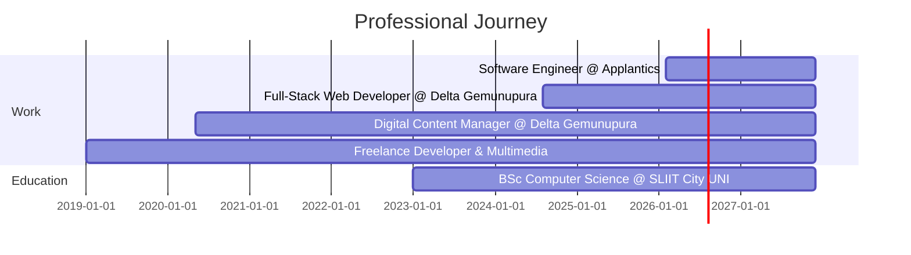

 

 

---

## Intro

Software Engineer and Computer Science student at **SLIIT City UNI** (2023–2027), based in Pussellawa, Sri Lanka. I build full-stack products, backend systems, and AI/ML-aware web applications.

I currently work as a **Software Engineer at Applantics** and a **Full-Stack Web Developer at Delta Gemunupura College**, shipping tools that improve learning systems and scalable product experiences.

**10+ projects** · **2+ years coding** · **10+ technologies in active use**

---

## Featured work

<table>
<tr>
<td width="33%" valign="top">

### [MPK Library System](https://github.com/mahimapaseda/MPK-Library-System)

Open-source ILS for schools and colleges — accession cataloging, member portal, issue desk, automated fines, PDF reports.

`Laravel` · `Vue 3` · `Inertia` · `Tailwind`

[Source →](https://github.com/mahimapaseda/MPK-Library-System)

</td>
<td width="33%" valign="top">

### [The Local Cart](https://github.com/mahimapaseda/localcart-ecommerce)

Production MERN e-commerce on Vercel, Render, and MongoDB Atlas — JWT auth, admin analytics, Swagger docs.

`React` · `Node` · `Express` · `MongoDB`

[Live](https://localcart-ecommerce.vercel.app/) · [Source →](https://github.com/mahimapaseda/localcart-ecommerce)

</td>
<td width="33%" valign="top">

### [Delta College DBMS](https://github.com/mahimapaseda/Delta-Gemunupura-College-School-DBMS)

Android school management system featured in national newspapers — staff, students, exams, timetables.

`Kotlin` · `Firebase` · `MVVM`

[Source →](https://github.com/mahimapaseda/Delta-Gemunupura-College-School-DBMS)

</td>
</tr>
</table>

<a href="https://mahimapaseda.vercel.app/projects"><strong>View all projects →</strong></a>

---

## Skills

**Frontend**

**Backend & data**

Robotics & IoT

Arduino · NodeMCU · ESP32

---

## Recent wins & credentials

| When | Note |
|------|------|
| May 2026 | Open-sourced [MPK Library System](https://github.com/mahimapaseda/MPK-Library-System) |
| Nov 2025 | School Management System featured in *Sunday Times* & *Sunday Observer* |
| Jun 2025 | AURA Colours Awards 2025 — resource evaluation |

---

## Career

**Software Engineer** — Applantics · Feb 2026 – Present  
Scalable architectures, backend services/APIs, performance and delivery with cross-functional teams.

**Full-Stack Web Developer** — Delta Gemunupura College · Aug 2024 – Present  
Responsive web apps, Java/backend and database work for students and staff.

**Digital Content Manager & Social Media Manager** — Delta Gemunupura College · May 2020 – Present  
Institutional digital presence, multimedia content, and brand-consistent distribution.

**Freelance Developer & Multimedia Professional** — Self-employed · 2019 – Present  
Web/mobile builds, multimedia production, and technical content for clients.

```mermaid
gantt
    title Professional Journey
    dateFormat YYYY-MM
    section Work
    Software Engineer @ Applantics                    :2026-02, 2027-12
    Full-Stack Web Developer @ Delta Gemunupura      :2024-08, 2027-12
    Digital Content Manager @ Delta Gemunupura       :2020-05, 2027-12
    Freelance Developer & Multimedia                 :2019-01, 2027-12
    section Education
    BSc Computer Science @ SLIIT City UNI            :2023-01, 2027-12
```

---

## GitHub

---

## Connect

  

> *Code with purpose. Design with passion. Build with vision.*

 

